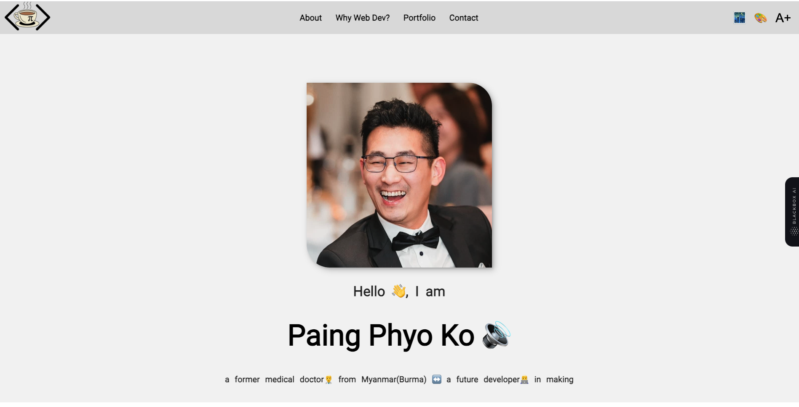

# My Personal Web Developer Showcase Website :rocket:

Hello, World! :wave: I'm **Paing Phyo Ko**, a medical doctor from Myanmar turning over a new leaf by diving into the fascinating world of web development. This repository contains my personal website, which I built as a part of my application for Founders And Coders.

## :star2: Why This Website?

1. **Introduce Myself** - Learn more about my journey and experiences.
2. **My Career Transition** - Understand why I decided to transition from a career in medicine to web development.
3. **Showcase My Skills** - Witness the web development skills I've learned in action.
4. **Founders And Coders Application** - Meet the requirements for the Founders And Coders application process.

## :hammer_and_wrench: Technology Stack

- HTML
- CSS
- Vanilla JavaScript

## :no_entry_sign: Note

- The website does not use any external libraries such as Bootstrap, React, or Jekyll themes.
- It is simple, clean, and built from scratch.
- There are dark mode, color-blind mode and lager font mode included for some users.

## :earth_africa: Hosting

This website is hosted using GitHub Pages.

:link: [Visit My Website](https://paing-ko.github.io/myWebsite/)

## :file_folder: Repository

The code for this website is open source and available on GitHub.

:link: [GitHub Repository](https://github.com/Paing-Ko/myWebsite)

## :envelope: Feedback and Contact

I would love to hear your feedback! If you have any comments, suggestions, or want to connect, please don't hesitate to reach out.

:email: paingphyoko.keke@gmail.com

## :heart: Thank You!

Thank you for taking the time to explore my website. I'm excited about my journey in web development and sharing it with the world.

Warm regards,

**Paing Phyo Ko**

---
